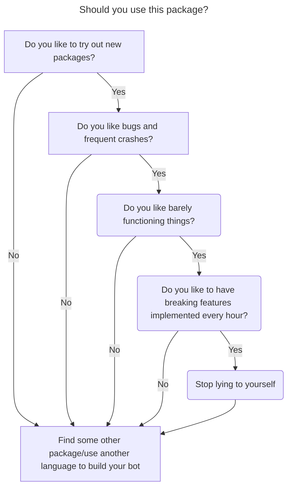

# Discord.swift

A Discord API wrapper completely built with Swift.

> ⚠️ This package is in development.

```mermaid
---
title: Should you use this package?
---
flowchart TD
    A[Do you like to try out new packages?] -->|Yes| B[Do you like bugs and frequent crashes?]
    B -->|Yes| C(Do you like barely functioning things?)
    C -->|Yes| D(Do you like to have breaking features implemented every hour?)
    D -->|Yes| E(Stop lying to yourself)
    A -->|No| F[Find some other package/use another language to build your bot]
    B -->|No| F
    C -->|No| F
    D -->|No| F
    E --> F
```
